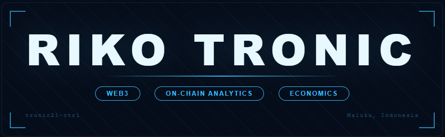

---

### Hi, I'm Riko 👋

Self-directed Web3 developer from **Maluku, Indonesia** — with a background in **Development Economics**. I build on-chain analytics tools and DeFi protocols, combining economic thinking with smart contract engineering.

Currently building **[TronicLens](https://troniclens.vercel.app)** — an on-chain intelligence dashboard for stakers, powered by The Graph, Chainlink, and 0G Network AI.

---

### 🔭 What I Build

| Layer | Stack |
|---|---|
| **Frontend** | React · Vite · Framer Motion · ethers.js |
| **Smart Contracts** | Solidity · Foundry · Hardhat · OpenZeppelin |
| **Indexing** | The Graph (Subgraph) · GraphQL |
| **Oracles** | Chainlink Price Feeds |
| **Decentralized AI** | 0G Compute (Qwen2.5 TEE) · 0G Storage |
| **Deployment** | Vercel · Sepolia Testnet · Blockscout |

---

### 🚀 Featured Project — TronicLens

> *On-chain intelligence for stakers who refuse to fly blind.*

**[🌐 Live Demo](https://troniclens.vercel.app)** · **[📁 Repo](https://github.com/tronic21-ctrl/troniclens)**

- 📊 Real-time staking analytics — TVL, Whale Activity, Staker Distribution
- 🔗 Live Chainlink ETH/USD price feed
- 🤖 AI Insights via 0G Compute (Qwen2.5-7b, TEE verified)
- 📡 Subgraph-powered data (tronic-staking v0.0.2, 100% synced)
- 💾 Snapshot storage on 0G Storage (Galileo Testnet)
- 🏆 Submitted to **ETHOnline 2026** (Sep 4–16)

---

### 📌 Projects

| Project | Description | Stack | Live |
|---|---|---|---|
| **TronicLens** | On-chain analytics dashboard for DeFi staking | React · The Graph · Chainlink · 0G | [↗](https://troniclens.vercel.app) |
| **DeFi Dashboard** | Multi-protocol DeFi portfolio tracker | React · ethers.js · CoinGecko API | [↗](https://defi-dashboard-pi.vercel.app) |
| **Crypto Tracker** | Real-time crypto price tracker | React · Vite · REST API | [↗](https://crypto-tracker-pi-silk.vercel.app) |
| **foundry-troniclens** | Smart contract test suite (16/16 ✅) | Foundry · Solidity | [↗](https://github.com/tronic21-ctrl/foundry-troniclens) |
| **solidity-contracts** | Collection of deployed Solidity contracts | Solidity · Sepolia | [↗](https://github.com/tronic21-ctrl/solidity-contracts) |

---

### 📊 GitHub Stats

---

### 🛠 Tech Stack

---

### 📬 Connect with me

---

  

  *TronicLens — Built for ETHOnline 2026 — Powered by The Graph · Chainlink · 0G Network*

